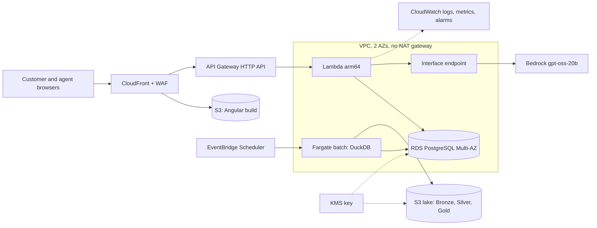

# ADR-004 — Capacity, cost and where each layer runs

- **Status:** Proposed (revised 2026-09-30; first version 2026-09-29)
- **Date:** 2026-09-30
- **Deciders:** Lucas Tramonte, Manoella R, Roberto Z
- **Workflow:** transaction-dispute intake, narrowed to unrecognized card charges with human handoff ([ADR-002](ADR-002-v1-workflow-unrecognized-charge-intake.md)). The recent-transactions view is the normal-resolution path and is costed with the same API. Why the other three official workflows were not chosen: [ADR-001](ADR-001-workflow-prioritization.md).
- **Supersedes:** the decision section of the former `Docs/Costs/Intake/INTAKE_COST_REVIEW.md`, and the September drafts `ArabicaAI-Architecture-Capacity-Costs-EN.pdf` and `ArabicaAI-Intake-Scale-Plan-EN.pdf`, which were never committed.

This is the only record for cloud cost, sizing and layer placement. `Docs/Costs/` holds the evidence it cites and nothing else.

## Context

The brief asks us to make "explicit trade-offs across autonomy, accuracy, latency, cost, and human oversight" and to "justify where AI is appropriate, where deterministic logic is preferable" (problem statement, p. 2). It also asks for capacity limits, monitoring, access controls, retention and the remaining deployment work (p. 4), and for p50/p95 latency and cost per attempted case and per successful automated resolution, with the workload and assumptions stated (p. 6). Extra workflows earn no automatic bonus (p. 3), and streaming and new model training are not required (p. 4). So what counts is showing where each piece runs and why, with numbers, and what would make us change it. Spending more does not.

Factored confirmed on Slack that the dataset (about 780–900 interactions a day) is not production volume, that a prototype isn't expected to carry full volume, and that recognizing sizing limits is part of the evaluation. Nothing below is a production forecast.

- **Evaluation window:** submissions close on 2026-10-05, finalists are announced on 2026-10-15 and awards follow on 2026-10-16 (kickoff deck, p. 6). Everything online is shut down after 2026-10-20, which shortens the 2026-10-31 window first set in ADR-003.
- **Prototype runtime:** Cloudflare Workers + D1 ([ADR-003](ADR-003-intake-single-runtime-worker-d1.md)).
- **Learned component:** a fact extractor on Workers AI gpt-oss-20b ([ADR-006](ADR-006-learned-extractor-workers-ai.md)). The policy stays deterministic.

### Demand evidence (synthetic sample, full Silver build, 2023-06-17 → 2026-06-18)

| Measure | p50 | p95 | Max |
|---|---|---|---|
| Call-center interactions per day | 664 | 818 | 894 |
| `Queja` interactions per day | 111 | 145 | 169 |
| `Cargo no reconocido` complaints per day (2025) | 11 | 17 | 23 |

The busiest hour held 60 interactions. The hour-of-day profile is flat (about 4.2% of the day every hour), which real contact centres don't show, so peaks use a 3× factor that is an **assumption**. Contacts come from Mexico (50.0%), Colombia (30.1%) and Argentina (19.9%).

### Scenarios, and which layer each one tests

Each scenario answers a different question, so each one binds a different layer:

| Scenario | Per day | Basis | What it tests |
|---|---|---|---|
| S1 | 17 episodes | p95 `Cargo no reconocido` complaints, the closest proxy for V1 demand | Cost per case in scope, where fixed cost weighs most |
| S2 | 145 episodes | p95 `Queja` contacts: the ceiling if every complaint contact were screened by intake | Case storage and AI calls |
| S3 | 818 contacts | p95 of all contacts. Every contact passes authentication and routing, even out of scope | API, edge and WAF capacity (the front door) |
| S4 | 8,180 contacts | 10× S3 | Which limit breaks first |

Because production volume is unknown, costs are also given per unit, so a reader can scale them.

### Measured resources per episode

From `back-end/test/integration/budget.test.js` against local D1, which reads D1's own row counters:

| Unit | Worker requests | D1 queries | D1 rows read | D1 rows written | Source |
|---|---|---|---|---|---|
| Page load (gated HTML document + identity list) | 2 | 0 | 0 | 0 | code |
| Customer: login + list + create case | 3 | 9 | 10 | 7 | measured |
| Agent refresh (session + 50-case page) | 2 | 4 | ≤155 | 3 | 155 is the full-page upper bound |
| **Episode (one of each)** | **7** | **13** | **165** | **10** | |

Rows written include index writes. A case takes about 367 bytes with a typical statement and 4.3 KB at the 2,000-character maximum. In production, Worker CPU was 0–4 ms per request (implementation notes).

Other measured inputs used below:
- **Serving slice:** 996,168 approved purchases at about 214 bytes per row in SQLite with the primary key and customer index, so about 0.21 GB. With customers and cards, about 0.3 GB.
- **Full history:** Silver is 2.86 GB in DuckDB (23.5 M rows), and Bronze is 1.4 GB of Parquet in 7,699 files.
- **Batch:** the full Bronze → Silver → quality build took 11 min 15 s on a laptop, with DuckDB capped at 2–3 GB and 2–4 threads (`data/full_local/pipeline.log`, 2026-09-29).
- **Front-end:** the Angular build is 5 files, 97 KB gzipped.
- **AI:** 2,106 input and 266 output tokens per extraction call, and 48/48 schema-valid outputs (`intake_agent/extractor/DEV_LOG.md`, iteration 4).

## Decision

### 1. Each layer runs where the measured load puts it

| Layer | Open-source or low-cost choice | AWS alternative | What the data says | Decision | Trigger to move |
|---|---|---|---|---|---|
| Batch: Bronze → Silver → Gold | Parquet + DuckDB | Glue, EMR, Athena | 2.86 GB builds in about 11 minutes on one machine | DuckDB, wherever it runs | Over ~100 GB, a build over 1 h, or several concurrent jobs |
| Online store | SQLite (D1) | RDS PostgreSQL, Aurora, DynamoDB | 165 reads and 10 writes per episode; the serving slice is about 0.3 GB | D1 in the prototype, PostgreSQL in the AWS target | A database over 5 GB (ADR-003's exit trigger; Paid caps at 10 GB), write p95 over 200 ms, cross-customer online queries, or a row-level security requirement |
| API | Cloudflare Worker | API Gateway + Lambda, ECS Fargate | 7 requests per episode, CPU 0–4 ms | Worker in the prototype, Lambda in the AWS target | Section 4 |
| AI extraction | Workers AI gpt-oss-20b ($0.0005 per call, measured) | Bedrock, SageMaker endpoint | 16/18 on development, p95 3.25 s | Workers AI for development and the frozen evaluation only. The live service calls it after the frozen run, behind a switch that falls back to the deterministic flow (ADR-006, decision 6). The same model runs on Bedrock in the AWS target | The extractor fails the frozen test on quality → the next ADR-006 rung |
| Observability | Workers logs and analytics | CloudWatch, X-Ray | About 29 log events per episode | Workers logs now, CloudWatch in the target | Moving the runtime |

The pattern is deliberate. Processing stays open source (DuckDB, SQLite, the same model), and the managed cloud services are the ones a bank needs for availability, private networking and audit.

### 2. The prototype stays on Cloudflare Free for the evaluation window

The daily quotas bound the service at **10,000 episodes a day**, and rows written is the binding quota (100,000 a day ÷ 10 per episode). That is 588× S1, 69× S2 and 12× S3. It is a daily bound, not a window capacity: storage is cumulative. With today's small seed, the 500 MB cap lasts about 136 days at 10,000 typical episodes a day, and about 12 days at maximum statement length. With the full serving slice loaded (about 0.3 GB), about 200 MB remain, which is about 54 days and 5 days. Either way, stored cases use under 1% of the cap at S1 over the whole window.

| Scenario | Worker requests/day | Rows read/day | Rows written/day | Highest use of a daily Free limit | 70% upgrade policy |
|---|---|---|---|---|---|
| S1 | 119 | 2,805 | 170 | 0.2% | not triggered |
| S2 | 1,015 | 23,925 | 1,450 | 1.5% | not triggered |
| S3 | 5,726 | 134,970 | 8,180 | 8.2% | not triggered |
| S4 | 57,260 | 1,349,700 | 81,800 | 82% | **triggers Workers Paid if sustained for 3 days** (the policy needs 3 consecutive days above 70%; S4 is a one-day stress case) |

**Cost of the prototype:** $0 on Free, and $5 a month on Workers Paid, which covers every scenario. **Cost per attempted case** is $0 on Free and $5 ÷ episodes per month on Paid ($0.0098 at S1). **Cost per successful automated resolution** is `not defined` for intake, because V1 always ends in a handoff (ADR-002). It is reported for the recent-transactions path once that path is measured.

Loading every customer's approved purchases (about 1 M rows) into D1 would take more than 20 days of the Free write quota, because index writes count too. If the team loads the full serving slice, it upgrades to Workers Paid for that month ($5). That is cheaper than any other way past the limit.

### 3. The production target on AWS, and what it costs

If a bank ran this workflow, it would ask for private networking, high availability, customer-managed keys and audit. Capacity would not be the reason. That target is estimated in the official calculator, and nothing is deployed from it:

**[AWS Pricing Calculator estimate](https://calculator.aws/#/estimate?id=2c6fd3cd749c39840166f0e274fd6813501f5f7e): $86.36 a month, $1,036.32 for 12 months** (US East (Ohio), On-Demand, list price, free tier not applied because a bank account shares it across workloads, tax excluded). Export: [`Docs/Costs/Intake/aws-pricing-calculator-2026-09-30.csv`](../Costs/Intake/aws-pricing-calculator-2026-09-30.csv).

The volumes are S3 for the front door (24,880 contacts a month, 124,400 API requests) and S2 for work in scope (4,410 episodes a month).

| Layer | Service | Sizing and its source | $/month | Why this and not the alternative | Trigger |
|---|---|---|---|---|---|
| Edge | CloudFront, pay as you go | 2.7 GB and 275,000 HTTPS requests (24,880 × 97 KB build + API), 50% US incl. Mexico, 50% South America | 0.70 | The always-free 1 TB and 10 M requests would make this $0; list price is shown. The flat-rate Pro plan ($15) caps overage, but Shield Standard is included and the WAF rate rule already bounds abuse | Over 10 M requests a month |
| Edge | WAF | 1 web ACL, 3 AWS managed rule groups (core, known bad inputs, IP reputation), 1 rate rule on the API | 9.17 | Bot Control and account-takeover protection ($10+ each) protect a login that belongs to the bank's identity provider, not to this service | Login moves into this service |
| Edge | S3 (site) | 0.01 GB (last 10 releases of a 326 KB build), 20,000 GETs from cache misses | 0.01 | A static origin, not an application server | — |
| API | API Gateway, HTTP API | 0.125 M requests, bodies capped at 16 KB | 0.13 | A REST API costs about 3.5× more for usage plans and keys we don't use; an ALB is about $16 fixed | Per-partner quotas or request validation |
| API | Lambda | Arm64, 124,400 invocations, 512 MB, 200 ms (assumed, including the in-region database trip) | 0.19 | Section 4 | Section 4 |
| Data | RDS for PostgreSQL | db.t4g.small Multi-AZ, 20 GB, 7-day backups included | 52.05 | Sized for availability and memory (a working set under 1 GB in 2 GiB), not CPU (about 0.25 API requests a second at 3× the busiest observed hour). Single-AZ (about $26 with storage) could lose accepted cases in an AZ failure. The Multi-AZ DB cluster (about 50% more) buys readable standbys we don't need. Aurora Serverless v2 costs more at its minimum. DynamoDB loses the foreign keys and uniqueness the idempotency tests rely on. RDS Proxy (about $22) solves connection pressure we don't have | CPU p95 over 60% or connections over 80% → db.t4g.medium; Lambda connection errors → RDS Proxy; 2–3 stable months → reserved instance |
| Data | PrivateLink | 1 interface endpoint (Bedrock) in 2 AZs, 0.05 GB | 14.60 | A NAT gateway costs about $33 plus traffic. RDS IAM authentication signs tokens locally, so no Secrets Manager endpoint is needed. Tracing uses correlation IDs in Lambda logs, so no X-Ray endpoint either ($14.60 more) | More than 3 AWS services called from the VPC → compare against NAT |
| Data | Public IPv4 | The batch task's address, about 10 h a month, no inbound rules | 0.05 | Private subnets would need 3 more endpoints (about $44) just to pull the image and ship logs | — |
| AI | Bedrock, gpt-oss-20b, In-Region, On-Demand | 5,400 calls entered (1 a minute for 3 h a day over 30 days), a conservative rounding of 4,851 (4,410 episodes × 1.1); 2,106 in / 266 out tokens | 2.57 | The same model that was registered and evaluated, so moving providers needs no new evaluation, and In-Region keeps processing in us-east-2. That is $0.00048 a call, against $0.0005 on Workers AI. Provisioned throughput bills by the hour for about 160 calls a day. Prompt caching isn't worth the complexity at $2.57 | AI cost over ~$50 a month → prompt caching |
| Batch | S3 (lake) | 13 GB: Bronze 1.4 GB plus 8 Silver/Gold rebuilds kept 7 days by lifecycle; 15,000 PUTs, 250,000 GETs | 0.47 | Standard, because the data is read daily; Infrequent Access charges retrieval and a 30-day minimum on data rewritten every day | Incremental builds would cut GETs |
| Batch | Fargate | 1 task a day, 15 min (11 min 15 s measured, plus margin), 2 vCPU, 4 GB, Arm | 0.60 | The same DuckDB code. Glue at its 2-DPU minimum would be about $6.60 a month and a rewrite to Spark; EMR is for much larger data | Section 1 |
| Ops | CloudWatch | 10 custom KPI metrics, 1.4 GB of logs (0.4 GB of it WAF), 30-day retention, 10 alarms, 1 dashboard | 4.76 | Vended metrics are free. Synthetic canaries (about $10), Lambda Insights, RUM and Application Signals add cost without a question to answer at this volume | Real users → RUM |
| Ops | KMS | 1 customer-managed key, 20,000 requests with S3 Bucket Keys | 1.06 | The AWS-managed key is free but gives no key policy, revocation or separate audit trail | Logs owned by another team → a second key |
| | **Total** | | **86.36** | | |

About three quarters of the total is the Multi-AZ database and the private endpoint. That spend comes from bank requirements, not from volume. Scaled:

| Scenario | AWS $/month | Cost per episode in scope | Cost per front-door contact |
|---|---|---|---|
| S1 volume | about 85 | $0.16 | — |
| Base (S2 in scope, S3 front door) | 86.36 | $0.020 | $0.0035 |
| S4 (10× both) | about 126 | $0.0029 | $0.0005 |

The S4 row scales only the volume-driven lines (CDN, WAF requests, API, Lambda, Bedrock, logs). At ten times the traffic the bill rises by about 46%, and the cost per contact falls by about 7×.

### 4. Lambda for the API, Fargate for the batch

The two services put different work on the team. Lambda leaves the code and the runtime version to maintain; AWS retires Node versions, and ours is pinned in infrastructure code. Fargate adds the container image (base patches, CVE scans), scaling policies, a minimum of two tasks for availability, and health checks. At about 0.05 API requests a second on average, and about 0.25 at 3× the busiest observed hour (60 contacts × 3 × 5 requests), the API is sparse. Lambda costs about $0.20 a month here, and two always-on Fargate tasks cost about $14 idle. The break-even is about 9 M requests a month, 7× the S4 stress case.

The batch is the opposite: one long, predictable job, which fits Fargate.

Move the API to Fargate on any of these:
- more than about 300,000 requests a day sustained;
- a p95 over budget that is caused by cold starts, measured separately from warm requests;
- a need for persistent connections (WebSocket, streaming).

Check the account's Lambda concurrency quota before any pilot, because new accounts can start low.

### 5. Services considered and not used

| Service | Why not | What would change it |
|---|---|---|
| SageMaker real-time endpoint | An ml.g6.xlarge is $1.13/h in us-east-2, about $822 a month always on (more with a second one for availability). Against $0.0005 per call, break-even is about 55,000 calls a day. At the S4 stress case the model gets about 1,600 calls a day (in-scope episodes only), so the endpoint would be about 34× over-provisioned; even if every S4 contact called the model (8,180 a day) it would be about 7× short of break-even. Training our own model is also unsound: the source text is templated (DF-001: 5 distinct complaint descriptions in 67,095 rows), so a model trained on it learns a lookup | Sustained volume above break-even, or a labelled corpus of real customer messages |
| Claude on Bedrock | About 7× (Haiku 4.5) to 14× (Sonnet 5) the cost per call of gpt-oss-20b (section 6) | The extractor fails the frozen test on quality (ADR-006 ladder) |
| Glue, EMR, Redshift, Athena | 2.86 GB builds in minutes with DuckDB | Section 1 trigger |
| Comprehend, Kendra, OpenSearch | Language comes from the session, events carry references only, and the policy is small and deterministic, so retrieval adds risk | Free-text policy content, or an unstructured knowledge base |
| Cognito | Identity belongs to the bank's provider; the brief accepts a trusted test session | A pilot with real customers |
| NAT gateway, RDS Proxy, X-Ray endpoint | Section 3 | Section 3 triggers |
| Hosting the prototype on RDS through Hyperdrive | D1 already holds the serving slice; RDS would add about $18 a month and a network hop with nothing to show for it | D1 triggers in section 1 |

### 6. AI cost, measured and enveloped

The per-call figures use the measured 2,106 input and 266 output tokens. The envelope column keeps the first version's 12k/2k-token episode, which ADR-006 cites for its model ladder.

| Model | Per call, measured tokens | Envelope per episode (12k in, 2k out) | S2, 4,851 calls/month | vs gpt-oss-20b |
|---|---|---|---|---|
| Workers AI gpt-oss-20b ($0.20 / $0.30 per M) | $0.00050 | $0.0030 | $2.43 | 1× |
| Bedrock gpt-oss-20b, In-Region (calculator) | $0.00048 | — | $2.33 | about 1× |
| Workers AI llama-3.3-70b ($0.293 / $2.253 per M) | $0.0012 | $0.0080 | $5.92 | about 2.4× |
| Claude Haiku 4.5 ($1 / $5 per M) | $0.0034 | $0.022 | $16.70 | about 7× |
| Claude Sonnet 5 ($2 / $10 per M) | $0.0069 | $0.044 | $33.30 | about 14× |

At the S4 stress case (10× the in-scope calls), multiply by 10. **Latency is the open question, not cost.** The development p95 of 3.25 s trips ADR-006's 3 s trigger. The response (the next rung or a recorded exception) has to be decided before pre-registration, and it is still open.

### 7. Operating the evaluation window

- **Monitoring:** Workers observability logs at 100% sampling. A weekly check covers requests per day, errors, CPU p95, D1 rows read and written, and database size against the triggers above.
- **Access:** Cloudflare Access in front of the whole hostname, plus the Basic gate on the API and HTML documents. Neither is customer authentication.
- **Retention and shutdown:**
  - **Until 2026-10-15:** nothing is deleted by age before judging ends, so judges see the cases in the recorded demo. Before each recorded demo, the team may reset cases and sessions only. Expired sessions are purged on every login.
  - **After 2026-10-20:** demo cases and sessions are exported for the record and then deleted from the remote D1, and the Worker is taken down.
  - **Data handling:** no real customer data is ever loaded.
- **AWS:** nothing in the prototype runs on AWS.
  - Spend to date is $0.21 (September 2026), from an exploratory RDS db.t4g.micro (`database-1`, created 2026-09-29, private, empty). It is deleted by 2026-10-20 at the latest.
  - The read-only IAM user used for pricing (`arabica-readonly`) and its access key are deleted at the same time.
- **Remaining deployment work before a real pilot:**
  - real authentication through the bank's identity provider;
  - separate preview and production databases;
  - alerting on the triggers;
  - a load test against the deployed service;
  - a cross-key duplicate rule;
  - data-handling approval for the model provider;
  - the migration in section 3, if the bank requires AWS.

## Consequences

- **+** One place answers where each layer runs, what it costs and what would change it. Every figure is a measurement, a list price, or an assumption named as such.
- **+** The prototype costs $0, and the production target costs $86 a month. Both are explained by requirements, not by volume.
- **+** Open-source processing (DuckDB, SQLite, gpt-oss-20b) carries over to the AWS target unchanged, so the evaluation stays valid after a migration.
- **−** Sizing rests on a synthetic sample with a flat hourly profile. Real peaks and volume could be very different.
- **−** Several inputs are assumptions:
  - the 3× peak factor and the 1.1 retry allowance;
  - 5 API requests for every front-door contact (measured per intake episode, assumed for out-of-scope contacts);
  - about 11 CDN requests per contact;
  - 8 retained rebuilds, 250,000 lake GETs and the log volume;
  - Lambda duration (200 ms) and the 15-minute Fargate budget.
- **−** The calculator estimate excludes tax, credits and free tier, and doesn't check eligibility for any specific account.

## Alternatives considered

- **Host the prototype on AWS with the credits** ($199.79 left on 2026-09-30, up from the $100 recorded in ADR-003). Nothing the evaluation measures would improve, and it would add operations and about $18–86 a month. Rejected. Reopen it if a requirement can't be met on Cloudflare.
- **One ADR per cost decision.** It would scatter sizing across records. Rejected: this record stays the single source, and `Docs/Costs/` holds only its evidence.
- **Size the AWS target for the whole database online.** The workflow reads only the serving slice (about 0.3 GB), and the full history belongs in the lake. Rejected: it would have meant a db.t4g.medium and 50 GB for no measured need.
- **CloudFront flat-rate Pro plan.** It costs $15 against about $9.87 for pay-as-you-go plus WAF, and its advantage (no overage) is already covered. Kept as the option if traffic becomes unpredictable.
- **Buy Workers Paid now.** Modelled use is under 9% of Free even at S3. Rejected, unless the full serving slice is loaded (section 2).

## Implementation notes

- **Evidence in `Docs/Costs/`** (index in [`Docs/Costs/README.md`](../Costs/README.md)):
  - the calculator export `Intake/aws-pricing-calculator-2026-09-30.csv`;
  - the Cloudflare workbook `Intake/INTAKE_COST_ESTIMATE.xlsx`, generated by `scripts/intake_cost/build_workbook.py`.
- **Calculator caveats, as exported:**
  - The six layers above were entered as one flat group.
  - The RDS line shows gp2. The price is the same as gp3 for Multi-AZ, and the target is gp3, for its 3,000-IOPS baseline at any size.
  - Bedrock was entered as 1 request a minute for 3 hours a day (5,400 calls), a conservative rounding of 4,851.
  - Some line descriptions say "measured" for the 5 API requests per contact and quote 0.35 req/s. The 5 requests are measured per intake episode and assumed for other contacts. This record uses 0.25 req/s: API requests only, at 3× the busiest hour.
- **Prices checked 2026-09-30** with the AWS Price List API (us-east-2) and the calculator:
  - RDS db.t4g.small Multi-AZ $0.065/h; Multi-AZ storage $0.23/GB-month;
  - interface endpoint $0.01/h per AZ; public IPv4 $0.005/h;
  - Lambda Arm $0.0000133334/GB-s; API Gateway HTTP $1.00 per million;
  - SageMaker ml.g6.xlarge hosting $1.1267/h.
- **Budget ceilings in CI** (per request, queries / rows read / rows written): login 4/8/6; list 2/25/0; create 4/12/6; agent login 3/6/6; agent list 2/250/0. Round trips per request are capped too: login 2, list 2, create 4, agent 1–2.
- **Measured in production, 2026-09-29** (one manual episode, so a sample rather than a load test):
  - **Placement:** the Worker ran in GRU (São Paulo), and the D1 primary is in ENAM.
  - **CPU and D1:** CPU was 0–4 ms per request. D1 round trips took 136–186 ms (median 148 ms), so latency is dominated by distance to D1, not by compute.
  - **Customer path:** login, list and case add up to about 1.4 s of server time.
  - **Static bundles:** they don't reach the Worker, so an episode is 7 Worker requests, as modelled.
  - **After batching the login writes** (deploy `aa0c804`): customer login went from 514 to 418 ms and agent login from 302 to 161 ms.
  - **Smart Placement** is enabled. No location is claimed until the `cf-placement` header shows `remote-…`.
- **Observability limits:**
  - Workers Logs Free allows 200,000 events a day, about 6,900 episodes at 29 events each; head sampling applies after that.
  - Logs are kept 3 days.
  - `Authorization` and `Cookie` are redacted.
  - The client IP is logged, so exported logs stay in the ignored `data/observability/`.
- **Sources:**
  - Cloudflare: [Workers pricing](https://developers.cloudflare.com/workers/platform/pricing/), [D1 limits](https://developers.cloudflare.com/d1/platform/limits/), [Workers AI pricing](https://developers.cloudflare.com/workers-ai/platform/pricing/), [Zero Trust plans](https://www.cloudflare.com/plans/zero-trust-services/).
  - AWS: [Pricing Calculator](https://docs.aws.amazon.com/pricing-calculator/latest/userguide/what-is-pricing-calculator.html), [Price List API](https://docs.aws.amazon.com/awsaccountbilling/latest/aboutv2/price-changes.html), [CloudFront](https://aws.amazon.com/cloudfront/pricing/), [Lambda](https://aws.amazon.com/lambda/pricing/), [RDS for PostgreSQL](https://aws.amazon.com/rds/postgresql/pricing/), [Bedrock](https://aws.amazon.com/bedrock/pricing/), [VPC](https://aws.amazon.com/vpc/pricing/).
