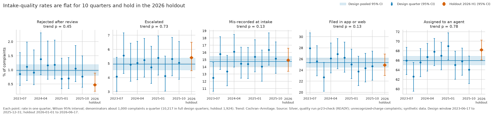
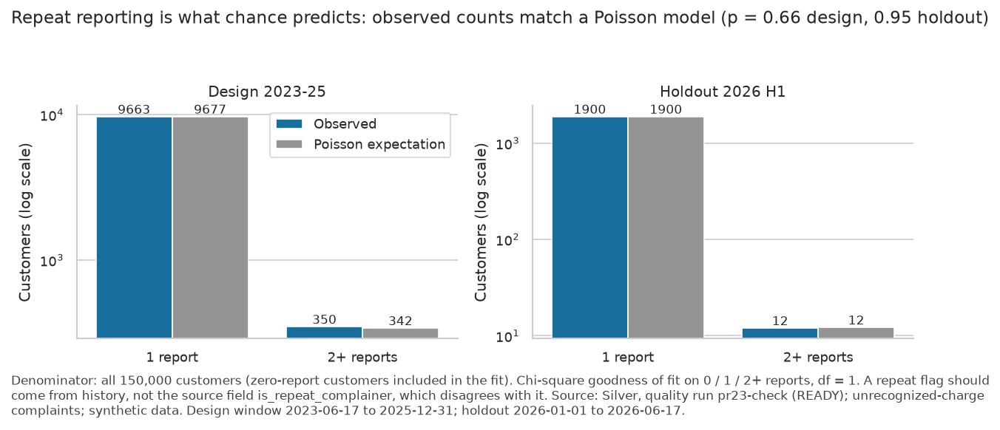
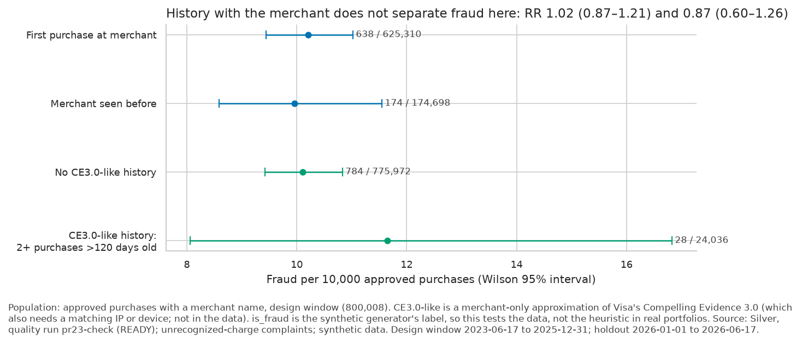
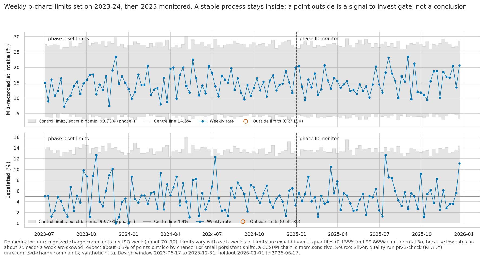
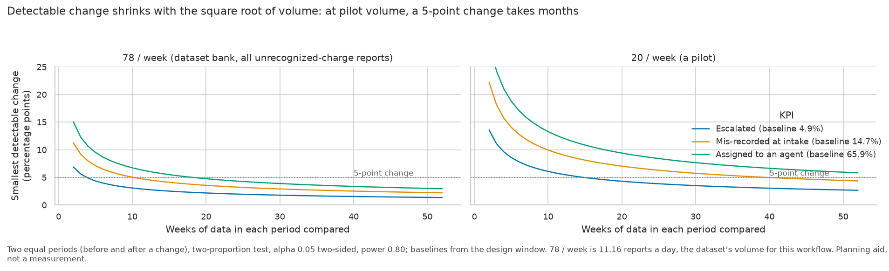

# Business outcomes: unrecognized-charge disputes

This is the business case for one problem at the LATAM bank: a customer sees a card charge they don't recognize and files a complaint, which the bank records as `Cargo no reconocido`. It sizes the problem, describes how the bank handles these complaints today, and states what our service changes, which outcomes we commit to measuring and what we can't claim.

We chose one workflow because the brief scores depth, not breadth. Unrecognized-charge intake was the largest complaint type that a deterministic boundary can make safe (nothing moves money, a person decides); the other candidates either change the account, lack outcome labels or have the least demand ([ADR-001](../ADRs/ADR-001-workflow-prioritization.md), [ADR-002](../ADRs/ADR-002-v1-workflow-unrecognized-charge-intake.md)).

## The data behind the figures

The data is synthetic. Every figure below is descriptive, and none of them is an effect of our product.

The figures come from Silver, quality run `20261002T232200Z` (390 checks, 0 errors, 7 warnings), over the design window 2023-06-17 to 2025-12-31 (929 days, [ADR-005](../ADRs/ADR-005-evaluation-data-protocol.md)) unless a figure says full period. The page with charts is [`product-report.html`](../../data_foundation/reports/product-report.html). Each figure sits next to the query that produced it in [`product-report.json`](../../data_foundation/reports/product-report.json), the quality run behind them is in [`product-manifest.json`](../../data_foundation/reports/product-manifest.json), and the queries are in [`data_foundation/queries/product/`](../../data_foundation/queries/product/). After `make pipeline`, `make product-report QUALITY_REPORT=data/quality_runs/<run-id>/quality_results.json` rebuilds all of it ([`DATA_ENGINEERING.md`](DATA_ENGINEERING.md)).

## The problem in numbers

| KPI | Value | Denominator and limit |
|---|---|---|
| Unrecognized-charge complaints | 11.16 a day | 10,370 complaints, 18.28% of 56,736. The share is stable by year (18.2–18.4%) |
| Recorded claims | US$2,327 a day in source USD; US$2,474 with FX estimates | Amounts are convertible on 3,296 of 10,370 complaints (31.78%): 835 recorded in USD (US$2,161,914.20) and 2,461 FX-estimated at the creation-day rate (US$135,989.84, flagged). Excluded: 6,919 with no amount and 155 with an amount but no currency. These are claims, not losses or savings. Each source currency is reported separately ([DF-023](DATA_ENGINEERING.md#df-023-amounts-share-one-usd-scale-and-claimed-currencies-ignore-the-customers-country)) |
| Complaint-contact workload | 11.08 observed-duration hours/day; 106.70 all-complaint contacts/day | All complaint contacts (`Queja`), not only unrecognized charges: 99,122 contacts over 929 days. The hours sum only the 85,261 observed durations (86.02%; mean 434.71 s); 13,861 missing durations are excluded, with no imputation. Turning this into a cost needs a rate the data doesn't have |
| Resolution of complaint contacts | 43.65%, against 76.61% for all contacts | 43,269 of 99,122, against 444,741 of 580,546 |

About eleven customers a day report a charge they don't recognize, and the contact channel they reach resolves complaints far less often than anything else it handles.

## How disputes are handled today

| Measure | Unrecognized charges | Other complaints |
|---|---|---|
| Unresolved (Open, In Process, Escalated) | 74.57% (7,733 of 10,370) | 75.09% |
| SLA breached | 20.11% | 20.03% |
| Assignment to first response, p50 / p90 | 25 / 44 hours (n = 6,045) | 25 / 44 hours |
| First response to resolution, p50 / p90 | 14.4 / 25.9 days (n = 2,241) | 14.7 / 26.2 days |
| Customer wait, creation to resolution, p50 / p90 | 15 / 27 days (n = 2,414) | 16 / 28 days |

The two columns are nearly identical. A customer looking at a large charge they didn't make treats it as urgent ([DF-024](DATA_ENGINEERING.md#df-024-purchase-amounts-are-almost-flat-up-to-usd-509-with-no-high-value-tail)), yet nothing in today's handling sets these complaints apart from any other.

Escalation is where cases disappear. None of the 514 complaints escalated in the window has a first response, resolution or closing date, in any year. Their age at the end of the data (535 days at p50 and 973 at p90 for all 618, full period) only reflects when they were created: escalated is a fixed label, not a stage a case passes through ([DF-028](DATA_ENGINEERING.md#df-028-complaint-statuses-are-fixed-labels-not-a-lifecycle)). So the data can't say how long an escalation takes.

Repeat complaints are rare, and they aren't re-opened disputes. 350 of 10,013 customers (3.5%) filed two or more, 707 complaints in all: of 10,370 complaints, 357 follow an earlier one by the same customer, 27 within 30 days, 64 within 90 and 92 after the earlier one had a resolution or closing date. That is as many as chance alone predicts (the Poisson check under [Decision KPIs](#decision-kpis-for-dispute-managers)), and the source has no re-opened status, so the data can't show a dispute coming back. The source's `is_repeat_complainer` flag disagrees with the complaint history and isn't used. In our service, "not resolved" on a closed report starts a new one that cites it (#90): the first real re-open signal, not yet exported.

Two data choices affect these rows. We kept the 52 window complaints whose outcome dates fall in 2026. We left out of the durations the 84 whose resolution date precedes their first response.

Underneath the timings sits a linkage problem. No complaint points to a transaction, and the product a complaint cites belongs to another customer ([DF-002, DF-003](DATA_ENGINEERING.md)). And 6,919 of the 10,370 complaints record no amount. An agent picking up a case has to work out which charge the customer meant before doing anything else.

## Satisfaction, each with its own population

The three satisfaction sources measure different people, so we don't combine them.

Closed-case satisfaction for unrecognized charges averages 3.07 of 5. Only 371 of 10,370 cases (3.58%) were closed in the window with a score, which makes it a selected subset.

Contact-centre CSAT (observed on a 1–4 scale) is 2.44 for complaint contacts and 2.83 for other contacts. Within each resolution outcome, every contact reason scores about the same: about 3.0 when resolved and 2.0 when not. Reasons with a lower average are the ones resolved less often. That is a descriptive association, not evidence that resolution causes satisfaction ([#86 F3](../Plans/insights-report.md#4-findings)).

| Contact reason | Contacts | Resolved | CSAT answers | Mean CSAT | If resolved | If not resolved |
|---|---|---|---|---|---|---|
| Queja (complaints) | 99,122 | 43.65% | 18,514 | 2.44 | 3.00 | 2.00 |
| Retención | 17,396 | 59.89% | 3,237 | 2.61 | 3.01 | 2.00 |
| Comercial | 46,417 | 65.05% | 8,677 | 2.65 | 2.99 | 2.02 |
| Técnico | 87,040 | 69.95% | 16,249 | 2.69 | 3.00 | 1.99 |
| Producto | 127,444 | 89.61% | 23,515 | 2.90 | 3.00 | 2.00 |
| Transaccional | 203,127 | 91.46% | 37,968 | 2.91 | 3.00 | 1.99 |

For NPS, 74.49% of 53,790 answers are detractors (0–6) and none is a promoter, because answers stop at 7. We report the distribution rather than the formal score, which would say nothing about loyalty here.

There is no survey CSAT for unrecognized-charge complainants at all. Surveys link to contact-centre interactions, not to complaints.

## The cuts: segment, country, channel and language

Segment and country are today's snapshot, not the values at complaint time; the channel is where the complaint was received. Cells under 30 are not compared.

| Segment | Complaints | Unresolved | SLA breached | Closed-case satisfaction | Complaint-contact CSAT |
|---|---|---|---|---|---|
| Basic | 6,221 | 74.51% | 19.90% | 3.01 (n = 205) | 2.44 |
| Plus | 2,557 | 74.74% | 21.47% | 3.28 (n = 100) | 2.42 |
| Premium | 1,053 | 74.83% | 20.51% | 3.00 (n = 45) | 2.44 |
| Student | 539 | 74.03% | 15.21% | too few (n = 21) | 2.41 |

Premium complaints stay unresolved and breach SLAs as often as anyone's. No segment is handled differently today, and neither is any country or reception channel:

| Cut | Complaints | Unresolved | SLA breached | First response p50 | Closed-case satisfaction |
|---|---|---|---|---|---|
| Mexico | 5,188 | 74.69% | 20.28% | 25 h | 3.07 (n = 181) |
| Colombia | 3,129 | 74.98% | 19.69% | 25 h | 3.04 (n = 120) |
| Argentina | 2,053 | 73.65% | 20.31% | 25 h | 3.10 (n = 70) |
| Call Center | 5,210 | 74.64% | 19.94% | 25 h | 3.16 (n = 190) |
| Email | 2,013 | 75.11% | 19.62% | 25 h | 3.06 (n = 83) |
| Web | 1,524 | 74.67% | 19.75% | 24 h | 3.12 (n = 43) |
| App | 1,103 | 73.98% | 21.67% | 24 h | 2.87 (n = 39) |
| Branch | 402 | 71.89% | 21.39% | 24 h | too few (n = 13) |
| Regulator | 118 | 75.42% | 21.19% | 26.5 h | too few (n = 3) |

Half of these disputes (5,210 of 10,370) arrive through the Call Center.

Language is recorded only by our live service. Its first export (2026-10-02, 5 team and reviewer episodes, on the flow that calls no model) has 1 Spanish and 4 Portuguese reports: 4 accepted as complete handoffs, 1 routed, 0 recorded unsafe. These are counts, not rates; the export and its method are in [EVALUATION.md §11](EVALUATION.md#11-other-measurements).

## What our service changes

The service doesn't resolve disputes. It changes how one starts. The customer signs in, describes the charge, picks it from their own recent purchases, confirms it, and gets a reference only after the case has been stored and read back. The agent receives the confirmed transaction, the customer's own words, what was checked and what is still open, instead of a complaint with no transaction attached. When no charge is confirmed, the case still reaches a person, marked as incomplete.

For the bank, that targets the linkage gap above: a confirmed case arrives tied to a transaction the customer owns. Reports on a charge above a stated amount, unusual for the customer, or flagged by the bank's own fraud engine ([ADR-011](../ADRs/ADR-011-proactive-alert-bank-flag.md)) lead the agent queue, which is the differentiated handling today's data shows is missing. The amount thresholds are policy we set, not values fitted to outcomes, and the flags in the prototype are authored.

For the customer, the receipt says what happened and what happens next, and the report's status stays visible after the tab closes. Nothing is refunded, blocked or decided by the system.

Whether any of this shortens the waits or raises satisfaction in the tables above is a hypothesis. This data can't test it: without complaint-to-transaction links, faster intake has no measurable business value here.

## Outcome measures we commit to

The definitions are in the [customer and measurement contract](../intake/customer-and-measurement-contract.md). Empty denominators are undefined, never zero, and results are reported by language before pooling.

| Measure | Numerator / denominator | Status |
|---|---|---|
| Safe accepted intake (primary) | Eligible episodes with an owned transaction, verified evidence, current confirmation, durable receipt and assessed safety / all eligible episodes started, including failures and abandonment | Not measured. Production doesn't assess safety, so none of the 5 live episodes counts as safe accepted |
| Unsafe outcome rate | Cases exposing another customer's data, inventing candidates, taking a prohibited action or handing off an unconfirmed match as complete / all attempted cases | A release gate at zero, measured offline ([`EVALUATION.md`](EVALUATION.md)) |
| Missed and unnecessary handoff | Against independently reviewed expected behaviour, each over its own gold denominator | Measured offline on authored cases |
| Receiving-agent readiness | Actionable packages / submitted packages, judged blind by an agent | Not measured |
| Customer effort, teach-back, intake CSAT | Real participants only, never simulated ratings | Not measured; a five-person moderated test comes first |
| Intake rework within 7 days | Accepted cases needing a correction / accepted cases with a full window | Deferred: complaints lack origin-interaction links |
| Cost per safe completed episode | Attributable charges / safe completed episodes | Not measured |

A handoff never counts as an automated resolution, so the brief's "safe automated resolution" has no numerator in this workflow. The learned component was compared with the checklist on held-out cases on 2026-10-04: 53 of 60 against 23, 0 unsafe, and 46 of 52 against 20 on the cases never exposed ([`EVALUATION.md`](EVALUATION.md#1-the-result)). That measures reading on authored messages, not a business outcome.

## Decision KPIs for dispute managers

Most dispute operations measure outputs: cases processed, refunds, write-offs. A dispute manager deciding whether intake works needs earlier measures:
- does intake let weak claims through, or push valid ones away?
- how much of the reporting activity becomes team workload?
- does the journey create friction?
- who keeps coming back?
- how much value is at stake on each side?

The table maps each question to a measure, gives the baseline in the supplied data, and names what our service records to measure it going forward.

**Baselines.** The baselines come from Silver, quality run `pr23-check` (391 checks, 0 errors, 7 warnings, READY, for the same DuckDB file). They cover unrecognized-charge complaints in the design window (2023-06-17 to 2025-12-31, ADR-005): 10,370 complaints, or 10,217 in the 10 full quarters used for trends. The queries are [`data_foundation/queries/intake_kpis/`](../../data_foundation/queries/intake_kpis/), the runner is `data_foundation/scripts/run_intake_kpis.py`, and the [aggregates](../Evidence/business/intake-kpi-baselines-design-2026-10-04.json) hold no row-level data. Intervals are Wilson 95%; trends are Cochran–Armitage over quarters.

| Manager's question | Decision KPI (numerator / denominator) | Baseline in the data | What our service records to measure it |
|---|---|---|---|
| How many reports don't end as a valid claim? | Reports that end without a complete handoff / reports started. The parts are: abandoned (idle-closed), "I can't find it", technical, and "I recognize it" on the bank's alert | Rejected after review: **0.98%** (100 / 10,217; 0.81–1.19%), no trend (p = 0.45). Mis-recorded at intake (an unrecognized charge filed as a suggestion or request): **14.75%** (14.08–15.45%), p = 0.13 | `intake_started`, `handoff_created.kind`, the idle-abandonment close, and `proactive_answers` (ADR-011) |
| How much of the activity becomes team workload? | Complete and incomplete handoffs / reports started; reports an agent opened within 24 h / handoffs | Assigned to an agent: **65.95%** (65.02–66.86%). Escalated: **4.94%** (4.54–5.38%). Both flat (p ≥ 0.73) | Handoffs, `first_opened_at`, and the received → in review → closed transitions |
| Did the cardholder persist after evidence against the claim? | Reports confirmed after one of three signals / all confirmed reports. The signals: the customer answered "I recognize it" on the bank's alert for the same charge; the customer chose "none of these" on the AI suggestions and still handed off; the agent marked a confirmed suggestion wrong | **Not measurable.** No complaint links to a transaction (DF-003), and the data has no authentication evidence (3-D Secure, chip and PIN). A prior purchase at the same merchant **does not separate fraud**: fraud rate 0.102% for a first-time merchant against 0.100% for a merchant seen before, risk ratio **1.02 (0.87–1.21)** over 800,008 approved purchases, the same in 2023, 2024 and 2025. Neither does a merchant-only version of Visa's Compelling Evidence 3.0 heuristic (2 or more purchases at the merchant more than 120 days earlier): **0.87 (0.60–1.26)** | `proactive_answers`, the suggestion choice, and the agent's mark (#113). "Seen this merchant before" can be shown to the agent as context, never as a suspicion score |
| Is the journey working or creating friction? | Drop-off at each step (started → reason → charge picked or "can't find it" → confirmed → handoff); episode span p50/p95; clarifications per report; technical failures / started | **Not observable.** The digital events contain no dispute journey, only views of `/help`. The live service has 5 team episodes (span p50 11.6 s, p95 14.7 s), which support no rate | Event timestamps per step (`intake-events.md`) and the idle close |
| Are the same cardholders reporting again and again? | Customers with 2 or more reports in 90 days / reporting customers; flag a customer whose count exceeds the Poisson baseline's 0.1% tail | Repeats are **what chance predicts**: 9,663 customers with 1 report, 350 with 2 or more, against a Poisson expectation of 9,677 and 342 (χ² = 0.19, p = 0.66). Median gap 280 days. The source flag `is_repeat_complainer` is **unreliable**: it marks 1,055 complaints whose customer has no other complaint, and misses 2,858 who have | Reports per customer, computed from the store, never from a flag |
| What is the value at stake on each side? | Median and quartiles of the charge amount, in its own currency, for deflected reports against reports that became handoffs. Never summed across currencies | Claimed amounts have the same scale whatever the outcome or currency (DF-023): a median of about 2,100–4,000 in every outcome group. Only 31.8% of complaints carry an amount and a currency, and rejected complaints are too few per currency (7–13) to compare | The confirmed charge's stored amount and currency; there is no amount when the charge isn't found |

*How to read it: each dot is one quarter's rate, its bar is the 95% interval, the shaded band is the whole design window's rate, and the orange diamond is the 2026 holdout. A dot outside the band is not a change by itself; the trend test (in each title) is. Every rate is flat, and the holdout falls inside or next to the band.*

*How to read it: if history with the merchant flagged questionable claims, the repeat-merchant rows would sit clearly lower than the others, with intervals that don't overlap. They don't. The label is the synthetic generator's, so this says the data can't validate the heuristic, not that the heuristic fails in real portfolios.*

**What these baselines say.** Every intake-quality rate in the supplied data is flat across 10 quarters, repeat reporting is random, and no transaction field we can link flags a questionable claim. That is the expected behaviour of a synthetic generator, and it is useful: it gives stable reference rates. But **the data can't show whether intake quality improves, or which claims are questionable**. Only the journey data our service produces can, so the measurement plan below is built on it.

### How we will measure it without leakage

1. **Historical baselines.**
   - They come only from the design window.
   - **Confirmation rule, fixed before the holdout is read (committed with this section):**
     - run the same queries once on the holdout window (2026-01-01 to 2026-06-17);
     - for each of the five rates, run a two-proportion z-test of holdout against design at α = 0.01 (0.05 / 5, Bonferroni). A baseline is confirmed when p ≥ 0.01;
     - repeat reporting is confirmed when the holdout Poisson fit has p ≥ 0.01;
     - the merchant-familiarity result is confirmed when the holdout risk-ratio interval includes 1.
   - Any baseline that fails is reported as unstable and not used as a reference.
   - **Result (run once on 2026-10-04, after the rule was committed in `478a7a7`).** The holdout window has 1,924 complaints, 2 quarters ([aggregates](../Evidence/business/intake-kpi-baselines-holdout-2026-10-04.json)). Every baseline is confirmed:

     | Baseline | Holdout | Test against design | Verdict |
     |---|---|---|---|
     | Rejected | 0.47% (9 / 1,924; 0.25–0.89%) | p = 0.029 | Confirmed, but the lowest margin: watch it |
     | Escalated | 5.41% (4.48–6.51%) | p = 0.39 | Confirmed |
     | Mis-recorded | 14.92% (13.39–16.58%) | p = 0.85 | Confirmed |
     | Digital channel | 24.90% (23.02–26.88%) | p = 0.69 | Confirmed |
     | Assigned to an agent | 68.19% (66.08–70.23%) | p = 0.056 | Confirmed |
     | Repeat reporters | Poisson fit (1,900 and 12 observed against 1,899.5 and 12.2 expected) | p = 0.95 | Confirmed |
     | Familiar merchant | Risk ratio 0.96 (0.45–2.04) | Interval includes 1 | Confirmed. The interval is wide because a short window has few repeat purchases (7,051) |

     The repeat flag disagrees with the history again: 265 flagged without another complaint, 118 not flagged with one.
2. **Service KPIs after deploy.**
   - The first 30 started reports, or 4 weeks, whichever comes later, form the service's own baseline. No change to the flow is made during it.
   - After that, each rate is tracked weekly on a p-chart whose limits come from the baseline period. Use exact binomial limits, not normal 3σ: at about 75 reports a week a low rate is skewed, and normal limits raise false alarms. On the supplied data, limits set on 2023–24 leave all 130 weeks inside for two rates, as a stable process should (below). A point outside is a signal to investigate, not a conclusion.
   - For small, persistent shifts, add a CUSUM chart (ISO 7870-4), which accumulates deviations and detects a shift a p-chart misses.

   

   - **How long until a change is visible.** The smallest change detectable between two equal periods (two-proportion test, α 0.05, power 0.80) shrinks with the square root of volume. At the dataset bank's 78 reports a week, a 5-point change in the mis-recorded share needs about 11 weeks per period. At a 20-a-week pilot it needs about 40 weeks. So a pilot's first weeks can show large effects only, and the plan says so in advance.

   
   - Comparisons between flow versions use the randomized A/B pilot (ADR-014, intention to treat) with the analysis fixed before the pilot starts.
3. **Instrumentation test set.**
   - Before the KPIs are trusted, a set of authored journeys, each with known expected counts, runs on local D1: abandon at each step, "I recognize it" on the alert, "can't find it", "none of these", a repeat reporter, a technical failure.
   - The KPI queries must reproduce those counts exactly.
   - The set tests the measurement, not the customers.
   - **Built (2026-10-04).** Fourteen authored journeys on the fictitious customers, in Spanish, Portuguese and English ([`kpi-journeys.json`](../../back-end/test/fixtures/kpi-journeys.json)), run over HTTP on local D1 in [`kpi-instrumentation.test.js`](../../back-end/test/integration/kpi-instrumentation.test.js). The KPI read, `intakeKpis` in `back-end/src/store/d1.js`, reproduces every hand-counted value exactly. The same episodes' events, scored by `evals/intake/episodes.py`, agree with it on every KPI the two share. A unit test fixes the 90-day and 24-hour boundaries. The definitions are in [`intake-events.md`](../intake/intake-events.md#dispute-manager-kpis-store-intakekpis).
   - Run the set with `cd back-end && node test/run-local.mjs` (CI runs it with every suite). Read the KPIs for a window with `node scripts/intake-kpis.mjs --since <date> [--until <date>]`; it reads local D1, and a person runs it with `--remote` on the deployed one.
4. **How the industry handles the same gaps, and what we take from it.**
   - **Show the purchase before the dispute.** Visa's Order Insight gives issuers and cardholders the purchase details before a dispute is filed, "helping to resolve issues early" ([Visa, friendly fraud](https://corporate.visa.com/en/solutions/visa-protect/insights/friendly-fraud.html)). Our flow does this by design: the customer picks the charge from their own list, with merchant, time and amount, before anything is reported.
   - **Prior undisputed history as evidence.** Visa's Compelling Evidence 3.0 treats at least two prior undisputed transactions with a matching IP address or device ID, older than 120 days, as evidence against a fraud claim (same source). The supplied transactions carry no IP or device, so IK-06 tests a merchant-only version, which shows no separation. **In production, capturing the device ID and IP at authorization would make this the first questionable-claim signal worth testing**, shown to the agent, never used to refuse.
   - **External benchmarks as priors, not baselines.** Visa reports first-party misuse ("friendly fraud") at around 20% of fraud disputes globally, and up to 30% for high-volume online merchants (2025 Global eCommerce Payments & Fraud Report, cited by Visa). Until our own deflection share exists, that range is a reasonableness check: a deflection rate far outside it means the flow, or the measure, needs a look. It is never reported as our result.
   - **Statistical process control, not dashboards of raw counts:** p-charts with exact limits and CUSUM for small shifts, as above.
   - **Plan the detectable effect before a pilot:** the chart above.
5. **What stays out of reach.** Real abandonment reasons, real fraud, and any savings or ROI figure. These need production traffic with a labelled outcome (a confirmed dispute result), which neither the data nor the demo has.

## What not to claim

- Claimed amounts are not losses, and source currencies are never added together.
- None of the time, SLA or satisfaction figures is an effect of our product. They are baselines to measure against.
- No complaint links to a transaction, so "large for this customer" can only be measured live.
- Survey answers about waiting are not measured wait, and wait is recorded only for phone contacts ([DF-027](DATA_ENGINEERING.md#df-027-wait-time-exists-only-for-phone-contacts-and-survey-wait-answers-dont-track-it)).
- The data is synthetic, and every association here is descriptive.

## Metric dictionary

Every published metric, with what it counts. "Window" is the design window unless it says *full period*; "UC" means `Cargo no reconocido` complaints created in that window. Queries are in [`data_foundation/queries/product/`](../../data_foundation/queries/product/).

| Metric | Population | Numerator / denominator | Window | Query |
|---|---|---|---|---|
| UC complaints a day; share of complaints | All complaints, by `creation_date` | UC complaints / 929 calendar days; UC / all complaints | Design | PR-01 |
| Recorded claims a day | UC complaints | Sum of claimed amounts in source USD, and with FX estimates (creation-day rate) / 929 days; coverage = convertible / UC complaints. Never summed across source currencies | Design | PR-02 |
| Complaint-contact workload | Contacts with `reason_category = 'Queja'` | Observed `duration_seconds` / 3,600 / 929 days; mean over observed durations only | Design | PR-03 |
| Resolution gap | Contact-centre contacts | `was_resolved` contacts / contacts, for `Queja` and for all reasons | Design | PR-03 |
| Unresolved share | UC complaints, and all other complaints | Status Open, In Process or Escalated / complaints (a status snapshot) | Design | PR-04 |
| SLA breach rate | Same | `sla_breached` / complaints with the flag | Design | PR-04 |
| Step durations (p50, p90) | Same, with both dates and a non-negative interval | Assignment → first response; first response → resolution or closing; creation → resolution; `resolution_days` | Design (outcomes may fall in 2026) | PR-04 |
| Escalated time open (p50, p90) | UC complaints with status Escalated | Data end (latest `creation_date`) − creation | *Full period* | PR-05 |
| Repeat customers and follow-up complaints | Customers with UC complaints; UC complaints | Customers with 2 or more / customers; complaints after an earlier one by the same customer (within 30 or 90 days, or after its outcome) / complaints. Matches IK-02 and IK-03, whose Poisson check shows the repeats are what chance predicts | Design | PR-10 |
| Closed-case satisfaction (F5) | UC complaints | Mean `resolution_satisfaction` over complaints closed in the window with a score; coverage = scored / UC complaints | Design | PR-06 |
| Contact CSAT, CES, NPS | Surveys joined one-to-one to their contact | Mean and share by score, by contact reason and resolution; NPS detractors (0–6) / answers | Design | PR-07 |
| Cuts by segment, country, channel | UC complaints, by the customer's snapshot segment or country, or by `reception_channel` | Unresolved, SLA breached, escalated / complaints; first response p50; F5 mean. Cells under 30 publish no numerators | Design | PR-08, PR-11, PR-12 |
| Complaint-contact CSAT by segment | CSAT surveys of complaint and other contacts | Mean score; share scoring 4 / answers | Design | PR-09 |
| Live outcomes by language | Report episodes in the live store at export | Counts only (5 episodes) | 2026-10-02 export | [EVALUATION.md §11](EVALUATION.md#11-other-measurements) |
