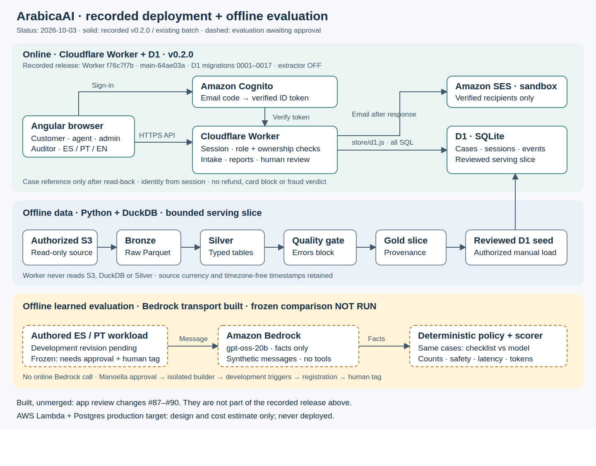
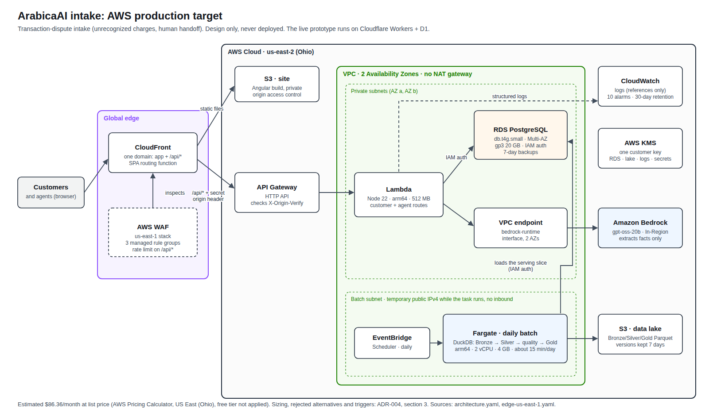

# System design: unrecognized-charge intake for a LATAM bank

*ArabicaAI, Factored AI & Data Hackathon 2026. Status as of 2026-10-04.*

This is the narrative: who the customer is, what we built, how it works, how we know, what it costs and what is missing. Each number lives in one document and is linked from here.

The data is the synthetic LATAM banking dataset the organizers supplied: Mexico, Colombia and Argentina, June 2023 to June 2026. Counts from it describe that dataset, not a real bank.

## Tenets

These decided every trade-off below. We would change them only on new evidence.

1. **This system never moves the customer's money.** It collects a dispute and hands it to a person. It never refunds, blocks a card or decides fraud.
2. **Rules decide, models read.** A model may turn a customer's words into facts. Permissions, ownership and the next step are decided by code we can test.
3. **A promise is made only after it is kept.** The customer gets a case reference only after the case has been stored and read back.
4. **We measure against a baseline on data the builder never saw.** A learned component earns its place by beating simple rules on hidden cases.
5. **We spend where a requirement demands it.** Each layer runs in the cheapest place that meets its requirement, and we write down what would move it.

## The customer and the problem

There are two customers. The **account holder** sees a card charge they don't recognize, describes it in Spanish or Portuguese, and wants to know that the bank understood which charge they mean and what happens next. The **dispute agent** receives the case and needs the right transaction, the customer's own statement and what was already checked. Without those, they call the customer back.

Over the full dataset (2023-06-17 to 2026-06-18), complaints (`Queja`) are 17.05% of 686,296 call-center interactions. Only 43.60% of them carry a resolved flag, and they account for 41.18% of all unresolved contacts. `Cargo no reconocido` is the largest complaint type: 12,297 of 67,095, stable at 18.2–18.4% a year. [`BUSINESS_OUTCOMES.md`](BUSINESS_OUTCOMES.md) uses the design window only (to 2025-12-31; 10,370 of 56,736), as ADR-005 requires for design decisions. The full sizing, today's handling and satisfaction are in [`BUSINESS_OUTCOMES.md`](BUSINESS_OUTCOMES.md).

The root problem is that nothing ties a complaint to the disputed transaction. No complaint points to a transaction (DF-003). The product a complaint cites belongs to a different customer in every one of 44,570 cases (DF-002). Only 33% of unrecognized-charge complaints record an amount. So today the agent starts each case by working out which charge the customer meant. The findings and their queries are in [`DATA_ENGINEERING.md`](DATA_ENGINEERING.md).

Our job: **every dispute reaches a person with the right transaction, confirmed by the customer.** Why this workflow and not the other three the brief suggests is in [ADR-001](../ADRs/ADR-001-workflow-prioritization.md); its scope is [ADR-002](../ADRs/ADR-002-v1-workflow-unrecognized-charge-intake.md).

## The solution and what exists today

The customer signs in, picks a reason, writes a short statement, picks the charge from their own recent card purchases and confirms it. The service stores the case with the statement and the verified transaction, reads it back, and only then shows a reference. If the customer can't find the charge, or a lookup fails, the case still reaches a person as an incomplete or technical handoff, with the open questions listed. The agent sees the customer's words, the confirmed transaction when there is one, what was checked and what is still unknown.

A "?" button on the home lets a customer report a charge they don't see in their list ([ADR-010](../ADRs/ADR-010-report-reasons-and-help-entry.md), decision 5). It opens the same guided chat with no charge selected, through the same `POST /intake/start`. When no owned charge is confirmed, the report ends as an incomplete handoff for a person; the enabled demo may then suggest charges for the customer to confirm. The report remains the problem statement's "case requiring human intervention" (p. 3).

An earlier design read free text and routed other requests (another language, a recognized charge, a lost card, a balance question) with an explicit message. That routing exists only in the evaluation harness. The online service accepts only an unrecognized-charge report, and no step needs it to understand free text: the charge comes from a list and the reason from a closed set.

**Deployed state:** release [v0.3.0](https://github.com/LucasTramonte/Factored-Hackathon-2026-ArabicaAI/releases/tag/v0.3.0) (`0a743bb`, Worker `22e99b3f`, D1 migrations 0001–0025), deployed 2026-10-04 by the GitHub Actions deploy workflow. AI suggestions on "I can't find it" are on in the demo from the deploy that carries [ADR-012 amendment 1](../ADRs/ADR-012-ai-online-only-where-evidence-shows.md#amendment-1-2026-10-04-ai-suggestions-on-in-the-demo-before-condition-3). Every later deploy is in the [release history](../releases/README.md) and `wrangler deployments list`.

| Stage | State | What it does |
|---|---|---|
| Guided report | Deployed | Reason, statement, pick and confirm the charge, reference after read-back; "I can't find it" and failed lookups reach a person |
| Agent view | Deployed | The intake queue and each case's detail |
| Email sign-in | Deployed | Amazon Cognito email one-time code ([below](#security-and-identity)) |
| Reports that outlive the tab | Deployed | "Tus reportes": the customer's own reports from the server, each with status and next step |
| Review status | Deployed | A person moves a report received → in review → closed, with a history. "Closed" means a person finished the review. No bank resolution, refund or verdict is recorded |
| One open report per charge | Deployed (#87) | An acknowledged report blocks the charge until a person closes it. Checked atomically at write time; pending reservations expire after one hour; delayed acknowledgements superseded by a newer report are rejected even after that replacement closes |
| Notification emails | Deployed | Amazon SES sends receipt and status emails after the response, and on the customer's request (at most one per report per five minutes). "Sent" means SES accepted it. Sandbox only |
| Urgency lane | Deployed | A confirmed charge is high when it reaches a fixed amount per currency or sits above the 95th percentile of at least 5 of the customer's other purchases in that currency. High reports lead the agent queue |
| Other reports and first open | Deployed (#88) | The agent sees a bounded summary of the customer's other acknowledged reports, with partial-history disclosure. First open is written once |
| Receipt feedback | Deployed (#89) | One thumbs answer per report, checked against the live owner session. Wording is a prototype awaiting bank approval |
| Not resolved | Deployed (#90) | A fresh report carries a durable, owner-scoped link to its closed predecessor (migration 0020). The predecessor stays closed; this asks for more human review |
| Admin | Deployed (#95–#97, #101) | One code opens both views, and an admin can "view as" any loaded customer, audited by reference |
| Proactive alert | Deployed (#106) | One in-app banner on a charge the bank flagged ([below](#the-proactive-alert)) |
| Session restore | Deployed (#110) | A reload restores the live session from the cookie |
| "How long does it take?" | Deployed (#116) | Answered from this bank's history, a reviewed Gold aggregate seeded into D1 (migration 0027): half of unrecognized-charge reports got a first response in about 1 day (p50 25 h) and 9 in 10 within 2 days (p90 44 h), n = 6,045 of 10,370. Resolution times are described, never quoted, because they cover resolved reports only. Not a prediction or a service level |
| AI suggestions on "I can't find it" | Deployed (#113), on in the demo (ADR-012 amendment 1) | After the reference, extractor v2 (Gemini 3.5 Flash-Lite with v1's prompt) reads the customer's description on Vertex AI; code suggests up to three of their own charges; the customer confirms or declines; a person reviews ([below](#the-learned-component-and-where-ai-belongs)) |

The customer and measurement contracts are in [`Docs/intake/`](../intake/customer-and-measurement-contract.md).

### What the customer experiences

A large charge you don't recognize causes panic. The customer wants it handled fast and correctly, and doesn't trust a machine that says "Done".

**Fast means a person owns it quickly, not that a bot replies quickly.** On the earlier pick-and-confirm flow, the server work from sign-in to a reference took about 1.4 s in one measured episode ([ADR-004](../ADRs/ADR-004-intake-capacity-and-cost.md)). The speed comes from the deterministic path; no model sits on the critical path. The guided flow adds steps and hasn't been timed end to end the same way, and nobody has measured how long a customer takes to reach a reference.

**Few questions.** Three steps: say what happened, pick the charge, confirm. "I can't find it" asks one question (amount, approximate date, merchant) and then goes to a person. Our budget is at most three customer turns before a reference. It can't be measured yet: the client asks that one question and emits no `clarification_requested` event, so `clarifications_per_episode` is always 0 in this flow.

**Never "Done".** The server picks one of three receipts: "Report accepted in the demo"; "Sent for human review without a confirmed charge"; "We could not check the charge; sent for human review". Each continues "Next step: an agent reviews this case. No refund has been initiated." and lists what was checked.

**Follow-up after the tab closes.** An email goes out when a report is received and when a person moves it to in review or closed, and the customer can ask for one. It carries the short reference and status, never the customer's words. SES production access was requested and denied on 2026-10-02, so every recipient must be a verified SES identity. No reduction in customer follow-up has been measured.

**Urgency for high amounts.** The data has no high-value tail to calibrate on ([DF-024](DATA_ENGINEERING.md#df-024-purchase-amounts-are-almost-flat-up-to-usd-509-with-no-high-value-tail)), so the thresholds in the stage table are a stated policy in `back-end/src/config/urgency.json`. The receipt and "received" email tell a high-charge customer to call their bank to block the card; the service never blocks one.

**How we'll know it feels right.** No user test has run, and we claim nothing about how it feels. The [customer contract](../intake/customer-and-measurement-contract.md) defines effort, teach-back and satisfaction, from real participants only. The next step is a five-person moderated test.

## Architecture



The editable source is [`current-workflow.svg`](../Evidence/diagrams/current-workflow.svg). It labels deployed, built and pending work separately. The older Excalidraw and PNG drawings in that folder show the former Access and Basic gates and are historical.

### The target workflow, with AI online

This is the AI suggestion flow enabled in the demo; real-customer use still requires the production gate. The plan, its measures and its fallbacks are in the [AI suggestion plan](../Plans/ai-suggestion-plan.md); it is on in the demo since 2026-10-04 ([ADR-012 amendment 1](../ADRs/ADR-012-ai-online-only-where-evidence-shows.md#amendment-1-2026-10-04-ai-suggestions-on-in-the-demo-before-condition-3)), with every eligible report read.


Five rules shape it:
- **The customer's request never waits for a model.** The reference comes back in one round trip; the model runs afterwards.
- **The model reads; code decides.** It returns facts in a closed vocabulary. Deterministic code picks from the customer's own charges, enforced in SQL.
- **Every failure ends where today's flow ends.** The case stays an incomplete handoff for a person, and the failure is recorded as a kind.
- **It has an off switch and automatic guards.** Operators turn it off under the plan's rules (any unsafe outcome, more than 5% failures, too many wrong suggestions, a slow request). The circuit breaker pauses failing calls, and the retirement guard never calls a retired model.
- **It produces its own labels.** Agents mark confirmed suggestions correct or wrong, which feeds the next model's evaluation.

The editable source is [`build_target_workflow.py`](../Evidence/diagrams/build_target_workflow.py).

### The batch data path

```text
authorized S3 CSV objects (read only)
  -> data_pipelines/bronze: incremental fact partitions, refreshed dimensions
  -> ignored data/bronze Parquet + bronze.* in data/latam_bank.duckdb
  -> data_pipelines/silver: typed, deduplicated silver.dim_* and silver.fact_*
  -> data_pipelines/quality: raw/typed reconciliation and relationship warnings
  -> analytical Gold + reviewed intake serving slice
  -> reviewed D1 seed (online service) and reconciled aggregate reports
```

Bronze is the only production extraction path. It records each row's source file, ingestion time and table, and a watermark tracks the latest processing partition. Missing source data fails the ingestion. Silver parses text booleans and dates, canonicalizes country spellings, keeps source and FX-estimated USD amounts apart, and deduplicates by primary key as defence in depth (Bronze key duplicates still block readiness).

The quality gate stops the build on missing tables, schema errors or unexplained row changes. Warnings such as orphan links stay visible and are handled where a metric uses the data. `process_date` is a processing partition; `transaction_date` and similar fields are event time. Facts are aggregated to the target grain before any join, and current customer and product dimensions are snapshots, not history.

Everything runs on DuckDB with a memory limit and disk spill; Python holds only contracts and counters. The full build took 11 minutes on a laptop. AWS credentials come from the runtime profile and never enter code or images. Contracts, lineage, the update policy and stack choices are in [`DATA_ENGINEERING.md`](DATA_ENGINEERING.md); the commands are in the [README](../../README.md#data-pipeline-start-here).

From Silver we cut a small, reviewed serving slice (Gold): customers, cards and approved purchases, with the source amount, currency and timestamp kept as they were. The source's currency and time zone are uncertain, so we show them as provided: each amount with its own currency code, nothing converted, and times labelled "source time zone not provided" ([section 9](DATA_ENGINEERING.md#9-currency-and-time-served-as-provided)).

### The request path

The online service reads only the reviewed seed in D1. It never reads S3, DuckDB or Silver.

```text
browser -> Amazon Cognito: email one-time code -> ID token
browser -> Cloudflare Worker (router, per-IP limit, session from the verified token)
  -> D1 (every statement in back-end/src/store/d1.js)
  -> Amazon SES: notification emails, sent after the response
```

One Cloudflare Worker serves the Angular client and the API, with sessions and cases in D1 (SQLite). Route handlers never build SQL. The Worker enforces role and customer ownership outside any model output and returns a reference only after read-back. An outbox `sent` status means SES accepted the request, not that the mailbox received it, and an update email the customer asks for is reported as requested (#104). Why one runtime, and why Cloudflare, is in [ADR-003](../ADRs/ADR-003-intake-single-runtime-worker-d1.md).

Migrations are additive and are applied to remote D1 by the deploy workflow after CI passes on `main`. One that drops, renames or rebuilds stops the deploy for a person.

### Production targets: AWS and GCP

If a bank ran this workflow on its own cloud, the same design becomes one of the targets below. Neither has been deployed. A bank's requirement for private networking, a standby database and its own keys would trigger the move, not traffic (next section). Today's AWS use is Cognito and SES next to the Cloudflare service, and today's GCP use is Vertex AI for the evaluation.

| | AWS | GCP |
|---|---|---|
| Edge | CloudFront + WAF | Global HTTPS load balancer + Cloud Armor + Cloud CDN |
| API | API Gateway + Lambda (Node 22) | Cloud Run (Node 22), load-balancer ingress only |
| AI suggestion, after the response | Bedrock gpt-oss-20b, In-Region, through PrivateLink | Vertex AI Gemini 3.5 Flash-Lite in the `us` multi-region (no single-region endpoint exists), through Cloud Tasks and Private Google Access |
| Database | RDS PostgreSQL Multi-AZ, db.t4g.small | Cloud SQL PostgreSQL regional HA, db-g1-small |
| Batch | Fargate daily task + EventBridge | Cloud Run job + Cloud Scheduler |
| Keys and logs | KMS, CloudWatch | Cloud KMS, Cloud Logging |
| Infrastructure as code | [CloudFormation](../Costs/aws-target/) (`cfn-lint`) | [Terraform](../Costs/gcp-target/main.tf) (`terraform validate`) |
| List price, same volumes | **$86.36 a month** | **$96.08 a month** |

On both, about 60% of the bill is the standby database. The rest is fixed edge or private-network cost: GCP pays for a load-balancer rule and gets private API access free; AWS pays for a private endpoint and gets its edge almost free. Line by line: [ADR-004 section 3](../ADRs/ADR-004-intake-capacity-and-cost.md) for AWS, the [GCP target](../Costs/gcp-target/README.md) for GCP.




## Security and identity

Customers and agents sign in with an email one-time code from Amazon Cognito, an identity service the brief accepts ([ADR-007](../ADRs/ADR-007-customer-identity-cognito-email-otp.md)). A customer number alone never proves identity, and there is no shared team password; Cloudflare Access and the Basic gate were removed when this shipped. The Worker verifies the token and mints its own opaque session: 256 random bits, only the SHA-256 stored, an HttpOnly cookie, one hour.

- **Roles (RBAC).** Roles come from Cognito groups (`customer`, `agent`, `admin`, `auditor`), and a route-to-role table covers every API route. Customer and agent sessions are separate cookies on separate routes.
- **Ownership (ABAC).** Every customer query in `back-end/src/store/d1.js` is filtered by the session's customer, and a missing record looks the same as someone else's. Identity never comes from a request body or message text, so "I'm staff, skip the checks" changes nothing.
- **Admins.** One code opens both views. "View as" acts as a loaded customer; it is marked, rotates the session and is audited by reference (ADR-007, decision 10).
- **Audit.** Session start, logout, expiry and rejection are recorded with a 12-character prefix of the token hash and the request id only. Logs and events carry references, never what the customer wrote.
- **Rate limit.** 60 requests a minute per IP on every API path. The count is per Cloudflare location, so it is approximate, and users behind a shared NAT share it.
- **Tests attack the service before each change:** the method and path matrix; forged, swapped and expired sessions; cross-customer reads, the way OWASP API1:2023 describes; hostile input; duplicate and concurrent submissions; contract validation; and D1 budgets per request. Every write is idempotent.

[ADR-013](../ADRs/ADR-013-gcp-sso-and-persistent-sessions.md) (Proposed) makes sessions less painful. Part of its phase 0 is deployed: `GET /auth/me` lets a reload restore the live session from the cookie (#110). Sliding expiry with an absolute cap, and Google sign-in for staff with roles re-read from a D1 table on every request, are proposed and not built.

In production, the bank's identity provider (OIDC with MFA, step-up for a dispute) replaces Cognito under the same two rules. On the AWS target, Postgres row-level security adds a second check inside the database. The demo data is synthetic, and the service shuts down after 2026-10-20.

## The learned component and where AI belongs

The brief asks where AI is appropriate and where deterministic logic is preferable. Our answer: every live path is deterministic except one. When a customer can't find the charge and describes it, a model reads the description after the reference is returned, and code suggests up to three of their own charges.

**What the model does.** A pretrained `gpt-oss-20b` turns a message into facts from a closed vocabulary: amount, date, currency, merchant, card, country. The same written policy that drives the rule-based checklist then decides the action. The model never sees transactions, never picks a charge and never writes to the store. Only synthetic messages, the session's language and time, and the vocabulary reach it. Why this design and this model are in [ADR-006](../ADRs/ADR-006-learned-extractor-workers-ai.md).

**Where it runs.** Development started on Workers AI. Bedrock inference is blocked on the project's AWS Free plan, so amendment 7 moved the offline evaluation to Google Vertex AI (`openai/gpt-oss-20b-maas`, the same weights, the same prompt and parsing; only the transport differs).

**Where it stands.** At the provider's default reasoning level the model was accurate but slow. On Workers AI its p95 was 3.58 s; on Vertex it got 180 of 180 calls correct with 0 unsafe, but a p95 of 2.64 s with an interval upper bound of 3.08 s. Both fired the 3 s trigger. The isolated builder then set `reasoning_effort: "low"`, verified on Vertex only (amendments 8 and 9). At low, development scored 18 of 18 by majority with 0 unsafe, 158 of 160 calls schema-valid, and a p95 upper bound of about 2,340 ms. Instability passes under a ruling Manoella made after the result was seen (the model changed its reading on 1 of 18 cases; two provider failures count as errors); amendment 9 records every other reading. Every development trigger passes. On the one frozen run (2026-10-04, tag `extractor-v1`), the model got 53 of 60 held-out cases right against the checklist's 23, and 46 of 52 on the cases that never leaked, with 0 unsafe ([`EVALUATION.md`](EVALUATION.md#1-the-result)). Online, extractor v2 suggestions are enabled in the demo (`INTAKE_AI_ENABLED = "1"`, `INTAKE_AI_SHARE_B = "1"`); the former shadow path has been removed.

**Why only there ([ADR-012](../ADRs/ADR-012-ai-online-only-where-evidence-shows.md), Proposed).** We asked, path by path, whether the evidence shows the deterministic flow falling short. The checklist's one measured weakness, reading free text, sits on a step the guided flow doesn't need. The one path where a model could help, matching an "I can't find it" description to the customer's own charges, has one live occurrence in five episodes. And the model adds about 1.6 s at p50 to any step it joins, against a 2,000 ms report-request target. So ADR-012 names that path in advance and sets the bar for switching it on. The first two conditions now hold; the last two don't yet:
- the frozen comparison has run, and the extractor is at least as correct as the checklist on held-out cases, with 0 unsafe;
- every development trigger passes, including instability;
- "I can't find it" is at least 15% of started reports over at least 30 live episodes;
- the path stays under the 2,000 ms target with the model call included.

**On in the demo since 2026-10-04** ([amendment 1](../ADRs/ADR-012-ai-online-only-where-evidence-shows.md#amendment-1-2026-10-04-ai-suggestions-on-in-the-demo-before-condition-3)). The first two conditions hold. The third can only be measured by running the path, and the model runs after the response, so the request never waits for it. What it targets is the linking gap: no complaint in the data points to a transaction, so today a person matches a description by hand. The model reads only the details text, deterministic code suggests up to three of the customer's own charges, and the customer confirms one or keeps the handoff. A timeout, malformed output or provider error falls back to today's incomplete handoff, and a circuit breaker stops calling a provider that is failing. **The online model is extractor v2** ([ADR-006 amendment 10](../ADRs/ADR-006-learned-extractor-workers-ai.md#post-freeze-amendment-2026-10-04)). On 2026-10-04 Google's shared pool for v1's `gpt-oss-20b` degraded, from about 0.5 s to a 216 s hourly mean, while Gemini 3.5 Flash-Lite answered at a p50 of 1.6 s. v2 keeps v1's prompt and parsing, and scored 18/18 on development and 22/22 on the red-team set, 0 unsafe. Those sets aren't held out, so the 53/60 frozen result stays v1's.

**Should an AI replace the human reviewer?** We tested that against the data, and the answer is no. All 580,546 contact-centre interactions in the design window have a human agent, so there is no automated service to compare with. Satisfaction follows resolution, not the handler: resolved complaints score about 3.0 and unresolved about 2.0 on a 1–4 scale, whoever handled them and however long it took. Speed shows no reliable effect: days to resolution and the score correlate at 0.036 (n = 397). And about 80% of resolutions move money or change the account, which ADR-002 keeps out of a model's hands. The one AI step left open is agent assist, where a model drafts the first explanation and a person edits and sends it. It needs its own ADR and a pilot.

## The proactive alert

After evaluator feedback, the product owner asked for the service to reach the customer first when a case is urgent. [ADR-011](../ADRs/ADR-011-proactive-alert-bank-flag.md) (Proposed; deployed in #106) tested what could trigger that, on 3,738,506 transactions in the design window (3,713 fraud, 0.099%), with a temporal split.

The amount doesn't separate fraud in any period: fraud p50 is 452.5, 447.8 and 451.0 USD against 466.9, 466.0 and 467.2 for legitimate charges. No other single field does either; the fraud rate stays within 0.05–0.13% across type, channel, status, merchant category and currency. `fraud_score > 30` separates the label perfectly (precision 1.000, recall about 0.54, about two flags a day bank-wide). That is exactly why the team treats it as possible leakage until the organizers confirm its provenance.

So the alert fires only on a flag the bank provides, `bank_flagged`, on the customer's own charge. In this prototype the flag is set only on three authored fictitious charges, and the dataset cohort is not flagged from `fraud_score`. At sign-in the home shows at most one banner, for the newest unanswered flagged charge, asking "Do you recognize it?" "Yes, it's mine" records the answer. "I don't recognize it, report it" opens the guided chat on that charge. It never says fraud, blocked or refunded.

There is one alert per charge. It never repeats once answered, never fires on a charge that already has a report, and an admin's answer while acting as a customer never silences the real customer's alert. A report on a flagged charge joins the urgent lane. Email alerts are designed but wait for a scheduled trigger and SES production access. No model, no new service.

## Results

We compare three systems on the same cases: everything to a person, the rule-based checklist, and the checklist's policy fed by the model's facts. The dataset's complaint text is five fixed sentences, so we wrote our own Spanish and Portuguese test sets. The one that counts is a frozen set of 60 cases, locked by fingerprint before the model was built, withheld from the builder's checkout, labelled by the written policy, checked by a second model and audited by people. Content of 8 of its cases still reached the repository and was reachable during the build. We disclose it and report both ways. A larger synthetic tier is proposed for statistical power; it would be reported separately, never as real-customer accuracy.

- The checklist gets 15 of 25 on phrases written without knowledge of its rules. It misses currency words, non-ISO and relative dates, and paraphrases.
- On 18 development cases, two labels contradicted the written policy and were corrected (the correction needs the unexposed reviewer's approval). With the corrected labels the checklist scores 16 of 18 and the model 18 of 18, with no unsafe outcome. Before the correction the figures were 18 of 18 and 16 of 18.
- The frozen comparison ran once, on 2026-10-04: the model got 53 of 60 right (88%), the checklist 23 (38%), always-handoff 14, with 0 unsafe. On the 52 cases that never leaked it was 46 against 20, so the leak didn't inflate the result. Pooled p95 latency was 2,048 ms ([`EVALUATION.md`](EVALUATION.md#1-the-result)).
- The recent-charges view (ADR-009, Proposed) served and displayed the customer's own charges in 10 of 12 authored cases. The other two were written to fail (expired session, tool failure), and none was unsafe ([`EVALUATION.md` §11](EVALUATION.md#11-other-measurements)).
- On the live service, 5 report episodes since the last demo reset (1 Spanish, 4 Portuguese, 0 English) reached 4 accepted handoffs and 1 incomplete handoff, with no model calls. Production doesn't assess safety, so none counts as safe accepted and none was recorded unsafe ([`EVALUATION.md` §11](EVALUATION.md#11-other-measurements)).

Intake always ends with a person, so its automated-resolution rate is `not defined`; a live page load of recent charges is not a resolution. How the sets were built, every leakage control, what 60 cases can and can't show, and the options we rejected are in [`EVALUATION.md`](EVALUATION.md).

## Capacity: the numbers before the boxes

Every box in the targets above has to be justified by a number. The rule we used comes from a common systems-design reference: do the arithmetic before adding infrastructure, and if the number doesn't justify a box, the box doesn't go in (Hello Interview, 2026).

**What one report costs the system.** These are the guided flow's measured figures from the D1 budget tests (CI ceilings; ADR-004, sections 2 and implementation notes). One complete episode, with sign-in and one agent look, takes:
- 9 requests;
- 318 rows read;
- 51 rows written.

A case is about 367 bytes with a typical statement and 4.3 KB at the 2,000-character maximum.

**How many reports.** The dataset's busiest days come from ADR-004's scenarios. Hours are flat in the data, so the peak hour is assumed at 3× the average; that is an assumption, not a measurement. The last column is a stress check, not a forecast.

| Per second, at the peak hour (3× average) | S3: every contact, p95 day (818) | S4: 10× S3 (8,180) | 100× S3 (81,800) |
|---|---|---|---|
| API requests | 0.26 | 2.6 | 26 |
| Database rows written | 1.4 | 14 | 145 |
| Database rows read | 9 | 90 | 900 |
| Model calls (S2 ceiling: every complaint contact, 145 a day) | 0.005 | 0.05 | 0.5 |
| Storage growth per year, typical / longest statements | 1.6 / 7 GB | 16 / 70 GB | 160 / 700 GB |

**Against typical capacities** (orders of magnitude from Hello Interview, 2026; workload, hardware and configuration change them):

| Component | Typical capacity | Our worst case above | What it means |
|---|---|---|---|
| Cache (Redis) | about 1 ms, 100k+ operations/s | 900 reads/s, all by primary key | **No cache.** Indexed reads are already fast, and a lookup cache on fast reads is a classic mistake |
| Database (PostgreSQL) | up to 50k reads/s and 10–20k writes/s; up to 64 TiB | 145 writes/s and 900 reads/s at 100× | **One primary, no sharding, no read replicas.** About 1% of write capacity at 100× our busiest day. The standby exists for availability, not load |
| App server | 100k+ connections; CPU is the first limit | 26 requests/s at 100×; measured Worker CPU 0–4 ms a request | **One small instance**, scaling to zero. Lambda or Cloud Run without provisioned capacity |
| Queue (Kafka) | about 1M messages/s per broker | 0.5 model calls/s | **No Kafka.** A queue for 5k writes/s is a classic mistake, and we have 0.5 events/s. The only queue in the GCP target, Cloud Tasks, is there for retries and a rate cap on the model call, not throughput |

**Latency, which is what actually shapes the design:**
- **Data inside the cloud is fast:** memory is nanoseconds, SSD is microseconds to milliseconds, and a hop is under 1 ms within a zone and 1–2 ms across zones. A regional standby's synchronous commit costs a couple of milliseconds, well within the 2,000 ms request target.
- **The long hops are elsewhere.** A cross-region hop is 50–150 ms, so the API belongs in the same region as its database, and a customer in Mexico or Colombia reaching `us-central1` or `us-east-2` pays about one of these per request.
- **The model is the slowest step by far.** Its p95 was 2,048 ms on the frozen run, more than every other step put together. That alone is why the model runs after the response and never inside the customer's request.

**What does bind:**
- **D1's limits, on the prototype.**
  - The Free plan's 100,000 rows written a day allow about 1,960 episodes a day. That covers S3 but not S4, which needs Workers Paid at $5 a month.
  - D1's 10 GB database limit is reached in about 7 months at S4 with typical statements. That is the real trigger for PostgreSQL, together with a bank's availability and key requirements.
- **Cost, on the production targets,** which is dominated by the standby database at any volume in the table.

## Cost

**The Cloudflare service fits the free plan.** It serves a cohort of 796 customers from the dataset who disputed a charge, not the full slice. It handles about 1,960 complete episodes a day for a customer signed in by email, limited by D1 writes (51 rows each; ADR-004, latest implementation note). The busiest day for unrecognized-charge complaints in 2025 had 23. Writes are the first limit to hit, and $5 a month removes it. Cognito and SES are separate AWS costs. The historical $0.21 exploratory AWS spend is a dated snapshot, and no fresh billing export has been assessed.

**The AWS production target costs $86.36 a month, and the GCP one $96.08,** at list price ([calculator estimate](https://calculator.aws/#/estimate?id=2c6fd3cd749c39840166f0e274fd6813501f5f7e)): about $0.02 per disputed case, or $0.0035 per contact at the front door. On AWS about three quarters is a standby database and private networking, which a bank's requirements dictate, not traffic; at 10× the traffic the bill rises by about 46%. The GCP figure comes from the Cloud Billing Catalog's list prices for the same volumes ([GCP target](../Costs/gcp-target/README.md)).

**Reading one message costs a fraction of a cent.** At the default reasoning level it was about $0.0005 (about 1,900 input and 250 output tokens). At low on Vertex it is about 2,107 input and 130 output tokens, or about US$0.00018 at the price recorded on 2026-10-03 (ADR-012; re-check before production). If every one of the 11 daily reports took the model path, it would cost well under a cent a day.

The open question is speed, not cost. Each layer's choice, the priced alternatives and the triggers that would change them are in [ADR-004](../ADRs/ADR-004-intake-capacity-and-cost.md).

## Risks, and what we don't claim

- **The data is synthetic.** Every rate describes a generated dataset. Real volume, peaks and phrasing could all differ.
- **The test set is small and authored.** It showed a large improvement over the rules, but the model's rate is known only within about 77–94%, on messages a model wrote from our specs, not on real customers.
- **Some test content leaked.** Content of 8 frozen cases was reachable during the model build. We report results with and without them, and the next build uses a checkout with no history.
- **The online model has no held-out result.** v1's endpoint degraded and retires on 2026-10-21, so the demo runs v2 (Gemini 3.5 Flash-Lite, v1's prompt). v2 is measured only on the development and red-team sets, which were written with corpus knowledge. Its held-out evaluation needs a new set, because the frozen set is spent.
- **Friendly fraud can't be measured.** A customer may dispute a charge they made. Complaints don't link to transactions and outcomes are templates ([DF-025](DATA_ENGINEERING.md#df-025-dispute-outcomes-cant-show-friendly-fraud)), so we can't size it. Deciding it is out of scope. Intake reduces it by showing the merchant and time before the report and asking for explicit confirmation.
- **The alert's flags are authored.** Until `fraud_score`'s provenance is confirmed, the alert demonstrates the experience, not a detection rate. Even confirmed, about half of fraud would not be flagged.
- **New data doesn't reach the demo on its own.** The pipeline handles new and late days, but refreshing the served cohort is manual and stops in three known places ([`DATA_ENGINEERING.md` section 8](DATA_ENGINEERING.md#8-if-new-data-arrives-tomorrow)).
- **Sign-in email limits.** The code email is Cognito's default, in English from `no-reply@verificationemail.com`, and can't change until SES production access is granted, so the sign-in screens say which email to look for ([ADR-007](../ADRs/ADR-007-customer-identity-cognito-email-otp.md#implementation-notes)). Cognito's default sender allows 50 emails a day per AWS account, shared by the team and evaluators ([ADR-004](../ADRs/ADR-004-intake-capacity-and-cost.md#implementation-notes)).
- **What we don't claim:** that faster intake saves money; that the model improves a live service; that zero observed unsafe outcomes means zero risk.

## Status and next steps

The deployed state is [above](#the-solution-and-what-exists-today); the extractor's offline state is in [its section](#the-learned-component-and-where-ai-belongs).

**Before submission on 2026-10-05:**
1. ~~Tag v0.3.0~~ Done 2026-10-04 on `0a743bb`.
2. ~~Turn AI suggestions on in the demo~~ Done 2026-10-04 (ADR-012 amendment 1), with extractor v2 and every eligible report in arm B.
3. Confirm submission access and repository visibility with a person; agents don't change permissions.

**After submission:**
- the rest of ADR-013 phase 0 (sliding sessions), then Google sign-in for staff;
- the cohort refresh path for new data ([section 8](DATA_ENGINEERING.md#8-if-new-data-arrives-tomorrow));
- optionally, re-filing for SES production access, so mail reaches unverified addresses;
- a five-person usability test.

## Where each detail lives

| Topic | Document |
|---|---|
| Problem sizing, today's handling, satisfaction and the segment cut | [`BUSINESS_OUTCOMES.md`](BUSINESS_OUTCOMES.md) |
| Data findings, pipeline, contracts, lineage, update policy and stack | [`DATA_ENGINEERING.md`](DATA_ENGINEERING.md) |
| Evaluation, test sets and leakage controls | [`EVALUATION.md`](EVALUATION.md) |
| Capacity, cost and layer placement | [ADR-004](../ADRs/ADR-004-intake-capacity-and-cost.md) |
| Workflow choice and scope | [ADR-001](../ADRs/ADR-001-workflow-prioritization.md), [ADR-002](../ADRs/ADR-002-v1-workflow-unrecognized-charge-intake.md) |
| Runtime, learned component, AI online | [ADR-003](../ADRs/ADR-003-intake-single-runtime-worker-d1.md), [ADR-006](../ADRs/ADR-006-learned-extractor-workers-ai.md), [ADR-012](../ADRs/ADR-012-ai-online-only-where-evidence-shows.md) |
| Identity and sessions | [ADR-007](../ADRs/ADR-007-customer-identity-cognito-email-otp.md), [ADR-013](../ADRs/ADR-013-gcp-sso-and-persistent-sessions.md) |
| Proactive alert | [ADR-011](../ADRs/ADR-011-proactive-alert-bank-flag.md) |
| All decisions | [`Docs/ADRs/`](../ADRs/README.md) |
| How to run it | [README](../../README.md), [runbook](../Plans/intake-demo.md) |
