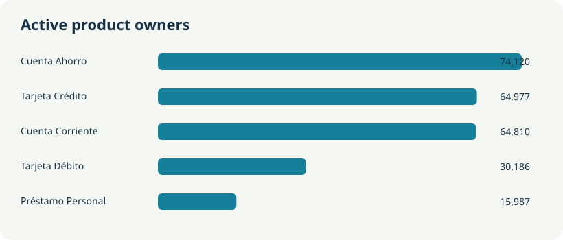

# Evidence reports

These reports contain aggregates from the local synthetic LATAM Bank CSVs. Open the HTML files locally after cloning the private repository; they make no external data requests.

## Marketing and product evidence



[Open the interactive Marketing and Product report](marketing_product.html) · [Inspect its aggregate JSON](marketing_product_summary.json)

The full run scanned 1,746,801 `campaign_sends` rows, 4,425,008 `transactions` rows, and 15,620,994 `digital_events` rows. It also used the 150,000 customers, 400,000 products, and 200 marketing campaigns. The run covered 3,280 CSV files across those six tables. No blank or duplicate primary IDs were observed in the scanned files.

| Finding | Observed numerator / denominator | Interpretation |
|---|---:|---|
| Delivered sends | 1,642,044 / 1,746,801 | 94.00% of sends with a known delivery flag. |
| Opens among delivered sends | 487,309 / 1,262,572 | 38.60% where the open flag is known; 484,229 sends have an unknown open flag. |
| Clicks among delivered sends | 97,793 / 1,642,044 | 5.96% where the click flag is known. |
| Recorded conversions | 9,799 / 1,746,801 | 0.56% of valid sends; this is the supplied send-level flag, not incremental lift. |
| Conversions 1–7 days after send | 7,451 / 9,799 | The remaining recorded conversions occur under 24 hours (249) or 7–30 days after send (2,099). |
| Customers with an active product | 134,516 / 150,000 | 89.68% in the supplied product snapshot. |
| Active products with `has_linked_app=True` | 169,570 / 339,965 | 49.88% of active products with a known flag. |
| Ordered product engagement | 929,139 / 1,837,415 | Sessions with login, a later Product-category event, and a linked product event. This is engagement, not proven acquisition. |

The report breaks campaign rates down by channel, objective, current customer segment, and country. It shows repeat exposure, current consent-field mismatches, product ownership and transaction activity by type, and event-quality coverage. Customer segment and consent are current snapshots, so they do not establish values at send time. Campaign controls and verified send-to-purchase links are unavailable; no causal attribution, uplift, or cross-currency ROI is claimed.

Reproduce the ignored full run from the repository root with:

```bash
python3 -m data_foundation.scripts.run_marketing_product --data-root data --run-id lucas_full
```

The run writes `summary.json`, `report.html`, `preview.svg`, and a file manifest under `data_foundation/runs/marketing-product/lucas_full/`. The curated files here combine the 2026-09-26 complete Product and Digital aggregates with a 2026-09-27 full rescan of campaign sends for conversion timing and the all-valid-send denominator. Both scans used the same input manifest. Its manifest fingerprint for input **names and byte sizes** was `8a748a9af661d6ede2f9f957aa1a29b3467242cc3b2ff8f255813456e30c40c5`; that fingerprint does not verify CSV contents.

## Separate time-series exploration

[Open the time-series dashboard](dashboard.html) · [Inspect its aggregate JSON](time_series_shifts_summary.json)

The time-series dashboard was added separately in commit `4060587`. Its workflow and modeling claims are separate from the Marketing and Product report above and from the [proposed ADR](../../Docs/ADR-0001-workflow-prioritization.md).
